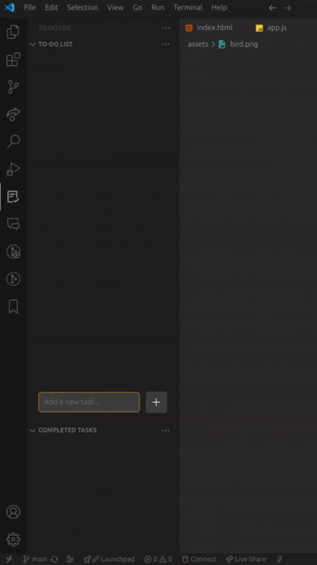
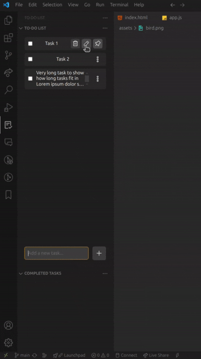
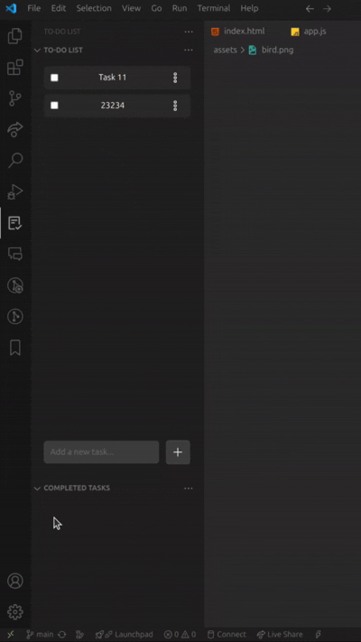
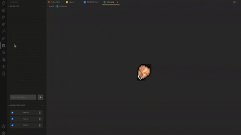

  

<h1 align="center">To-Do Manager</h1>

  
  
  
  

  <a href="#project-description">Project Description</a> • 
  <a href="#key-features">Key Features</a> • 
  <a href="#-whats-new-in-v105">Patch Notes</a> •
  <a href="#-installation">Installation</a>

  

## 🚀 Project Description

**To-Do Manager** is a fully-integrated task management extension for Visual Studio Code that transforms your editor into a smart productivity workspace. Designed by a developer for his fellow developers in mind, this extension introduces a clean and responsive sidebar UI for managing tasks without breaking your coding flow.

Whether you're tracking bugs, planning features, or just managing your personal goals, To-Do Manager helps you stay organized by allowing you to manage your tasks, all inside VS Code. Each completed task is automatically archived into a dedicated Completed Tasks section, keeping your main list focused and clutter-free.

Whether you’re working solo or as part of a larger team, To-Do Manager adapts to your process, allowing you to focus less on managing tasks and more on completing them.

## ✨ Key Features

Here's a breakdown of some of the main functionalities you would find with this extension.

  <table>
    <tr>
      <td align="center">
        <b>➕ Adding</b> 
        
      </td>
      <td align="center">
        <b>✏️ Editing</b> 
        
      </td>
    </tr>
    <tr>
      <td align="center">
        <b>📌 Pinning</b> 
        
      </td>
      <td align="center">
        <b>✅ Completing</b> 
        
      </td>
    </tr>
      <tr>
      <td align="center" colspan="2">
        <b>🗑️ Deletion</b> 
        
      </td>
    </tr>
    <tr>
      <td align="center">
        <b>📠Import / Export</b> 
        
      </td>
      <td align="center">
        <b>🧹 Clear All</b> 
        
      </td>
    </tr>
  </table>

## 🧠 What's New in v1.0.5

The following updates were introduced in version 1.0.5 to improve functionality and performance:

| Capability | Description |
|------------|-------------|
| 📁 Import/Export Pipeline | Backup and migrate task sessions using human-readable JSON files. |
| 🔁 Duplicate Resolution | Automatic prevention of same-task entry — including edge cases on restore/undo. |
| 📥 Restore on Reload | All task state is preserved between sessions using `workspaceState`. |
| 🧹 Clear All Context | One-click deletion of all completed tasks |

---

## 🛠 Installation

1. Open **Visual Studio Code**
2. Go to the Extensions panel (`Ctrl+Shift+X`)
3. Search for `"To-Do Manager"` by **Shoubhit Jamadhiar**
4. Click **Install**

Or install directly via [Visual Studio Marketplace →](https://marketplace.visualstudio.com/items?itemName=ShoubhitJamadhiar.to-do-manager)

## 📄 License

This project is distributed under the [GPL-3.0 License](https://github.com/Shobthebob/To-Do-List-Extension-VS-Code/blob/main/LICENSE).
